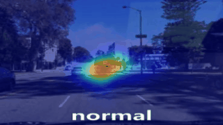
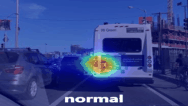
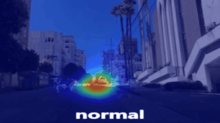

<div align="center">
<a name="start-anchor"></a>
</div>
<div align="center">
  
</div>

------

## 🔥Update

- **2025/05/15**: All the code and models are completed.
    - How to configure:  [command](#Run-train ) & [script](deployment.md)
    - How to train:  [command](#Run-train ) & [script](deployment.md)
    - How to evaluate:  [command](#Run-test ) & [script](deployment.md)
    - How to visualize:  [command](#Run-test ) & [script](deployment.md)

- **2025/03/25**: We collect existing meta-learning methods for driver saliency prediction.
     - Environment configuration
     	- *metadriver*: `PFENet (TPAMI'22)`, `BAM (CVPR'22)`. [Details](supplementary.md)
     	- *metadriver_mmcv*: `HDMNet (CVPR'23)`, `AMNet (NIPS'23)`, `AENet (ECCV'24)`. [Details](supplementary.md)
     	- *metadriver_mamba*: `HMNet (NIPS'24)`. [Details](supplementary.md)
     - How to Use? [Details](supplementary.md)
- **2025/02/05**: We collect driving accident data with data categories, divided into 4 folds by category.
    - DADA: 52 categories. It repartitioned into `DADA-52i`.
    - PSAD: 4 categories. It repartitioned into `PSAD-4i`.
- **2025/02/01**: We propose a model in order to ``learn to learn`` driver attention in driving accident scenarios.

## 💬Highlight [🔁](#start-anchor)

<div align="center">

</div>
### [1] Compare with Traditional Methods


### [2] Compare with Few-shot Methods


## ⚡Proposed Model [🔁](#start-anchor)

we propose a saliency mamba model, named **SalM²** that uses "Top-down" driving scene semantic information to guide "Bottom-up" driving scene image information to simulate human drivers' attention allocation. 


## 📖Datasets [🔁](#start-anchor)
<div align="center">
<table>
  <thead>
    <tr>
      <th>Dataset</th>
      <th>Accident</th>
      <th>Fold-0</th>
      <th>Fold-1</th>
      <th>Fold-2</th>
      <th>Fold-3</th>
    </tr>
  </thead>
  <tbody>
    <tr>
      <td>DADA-52i</td>
      <td>52</td>
      <td>a pedestrian crosses the road. ...</td>
      <td>there is an object crash. ...</td>
      <td>a motorbike is out of control. ...</td>
      <td>vehicle changes lane with the same direction to ego-car. ...</td>
    </tr>
    <tr>
      <td>PSAD-4i</td>
      <td>4</td>
      <td>a pedestrian crosses the road.</td>
      <td>there is an object crash.</td>
      <td>a motorbike is out of control.</td>
      <td>vehicle changes lane with the same direction to ego-car.</td>
    </tr>
  </tbody>
</table>
</div>

【note】 For all datasets we will provide our download link with the official link. Please choose according to your needs.

> (1) **DADA-52i**: This dataset we will upload in BaiduYun (please wait). Official web in [link](https://github.com/taodeng/CDNN-traffic-saliency "Official Traffic_Gaze").
>
> (2) **PSAD-4i**: This dataset we will upload in BaiduYun (please wait).  Official web in [link](https://github.com/taodeng/DrFixD-rainy "Official DrFixD-rainy").
>

<div align="center">
<table style="width: 100%; table-layout: auto;">
  <tr>
    <th>TrafficGaze</th>
    <th>DrFixD-rainy</th>
    <th>BDDA</th>
  </tr>
  <tr>
    <td>
      ./TrafficGaze<br>
      &emsp;&emsp;|——fixdata<br>
      &emsp;&emsp;|&emsp;&emsp;|——fixdata1.mat<br>
      &emsp;&emsp;|&emsp;&emsp;|——fixdata2.mat<br>
      &emsp;&emsp;|&emsp;&emsp;|—— ... ...<br>
      &emsp;&emsp;|&emsp;&emsp;|——fixdata16.mat<br>
      &emsp;&emsp;|——trafficframe<br>
      &emsp;&emsp;|&emsp;&emsp;|——01<br>
      &emsp;&emsp;|&emsp;&emsp;|&emsp;&emsp;|——000001.jpg<br>
      &emsp;&emsp;|&emsp;&emsp;|&emsp;&emsp;|—— ... ...<br>
      &emsp;&emsp;|&emsp;&emsp;|——02<br>
      &emsp;&emsp;|&emsp;&emsp;|—— ... ...<br>
      &emsp;&emsp;|&emsp;&emsp;|——16<br>
      &emsp;&emsp;|——test.json<br>
      &emsp;&emsp;|——train.json<br>
      &emsp;&emsp;|——valid.json
    </td>
    <td>
      ./DrFixD-rainy<br>
      &emsp;&emsp;|——fixdata<br>
      &emsp;&emsp;|&emsp;&emsp;|——fixdata1.mat<br>
      &emsp;&emsp;|&emsp;&emsp;|——fixdata2.mat<br>
      &emsp;&emsp;|&emsp;&emsp;|—— ... ...<br>
      &emsp;&emsp;|&emsp;&emsp;|——fixdata16.mat<br>
      &emsp;&emsp;|——trafficframe<br>
      &emsp;&emsp;|&emsp;&emsp;|——01<br>
      &emsp;&emsp;|&emsp;&emsp;|&emsp;&emsp;|——000001.jpg<br>
      &emsp;&emsp;|&emsp;&emsp;|&emsp;&emsp;|—— ... ...<br>
      &emsp;&emsp;|&emsp;&emsp;|——02<br>
      &emsp;&emsp;|&emsp;&emsp;|—— ... ...<br>
      &emsp;&emsp;|&emsp;&emsp;|——16<br>
      &emsp;&emsp;|——test.json<br>
      &emsp;&emsp;|——train.json<br>
      &emsp;&emsp;|——valid.json
    </td>
    <td>
      ./BDDA<br>
      &emsp;&emsp;|——camera_frames<br>
      &emsp;&emsp;|&emsp;&emsp;|——0001<br>
      &emsp;&emsp;|&emsp;&emsp;|&emsp;&emsp;|——0001.jpg<br>
      &emsp;&emsp;|&emsp;&emsp;|&emsp;&emsp;|—— ... ...<br>
      &emsp;&emsp;|&emsp;&emsp;|——0002<br>
      &emsp;&emsp;|&emsp;&emsp;|—— ... ...<br>
      &emsp;&emsp;|&emsp;&emsp;|——2017<br>
      &emsp;&emsp;|——gazemap_frames<br>
      &emsp;&emsp;|&emsp;&emsp;|——0001<br>
      &emsp;&emsp;|&emsp;&emsp;|&emsp;&emsp;|——0001.jpg<br>
      &emsp;&emsp;|&emsp;&emsp;|&emsp;&emsp;|—— ... ...<br>
      &emsp;&emsp;|&emsp;&emsp;|——0002<br>
      &emsp;&emsp;|&emsp;&emsp;|—— ... ...<br>
      &emsp;&emsp;|&emsp;&emsp;|——2017<br>
      &emsp;&emsp;|——test.json<br>
      &emsp;&emsp;|——train.json<br>
      &emsp;&emsp;|——valid.json
    </td>
  </tr>
</table>
</div>

## 🛠️ Deployment [🔁](#start-anchor)

### 		[1] Environment

*If you have downloaded our `repository code` and installed `PyTorch` and `CUDA`.*  [More details](deployment.md#(1)-Environment)

```python
pip install -r requirements.txt
```

### 		[2] Run train

*If you wish to train with our model, please use the command below.* [More details](deployment.md)

```python
sh scripts/train_MetaDriver.sh [datasaet] [split#] [backbone] [gpu]
```

> `dataset`: metadada, metapsad.
>
> `#`: 0, 1, 2, 3.
>
> `backbone`: resnet50, vgg.
>
> `gpu`: 0 or other.

​	*Example:*
```python
sh scripts/train_MetaDriver.sh metadada split0 resnet50 0
```

### 		[3] Run test

*We calculate the predicted values and then use python for the prediction.* [More details](metrics/README.md)

```python
sh scripts/test_MetaDriver.sh [datasaet] [split#] [backbone] [gpu]
```

​	*Example:*
```python
sh scripts/test_MetaDriver.sh metadada split0 resnet50 0
```

### 		[4] Run visualization

*If you want to visualize all the data of a certain dataset directly, you can use the following command.*

```python
sh scripts/visual_MetaDriver.sh [datasaet] [split#] [backbone] [gpu]
```

​	*Example:*
```python
sh scripts/visual_MetaDriver.sh metadada split0 resnet50 0
```

## 🚀 Live Demo [🔁](#start-anchor)

<div align="center">
  
  
  
</div>


## ⭐️ Cite [🔁](#start-anchor)


If you find this repository useful, please use the following BibTeX entry for citation  and give us a star⭐.

```python
waiting accepted
```

